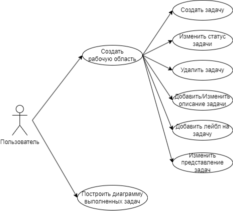
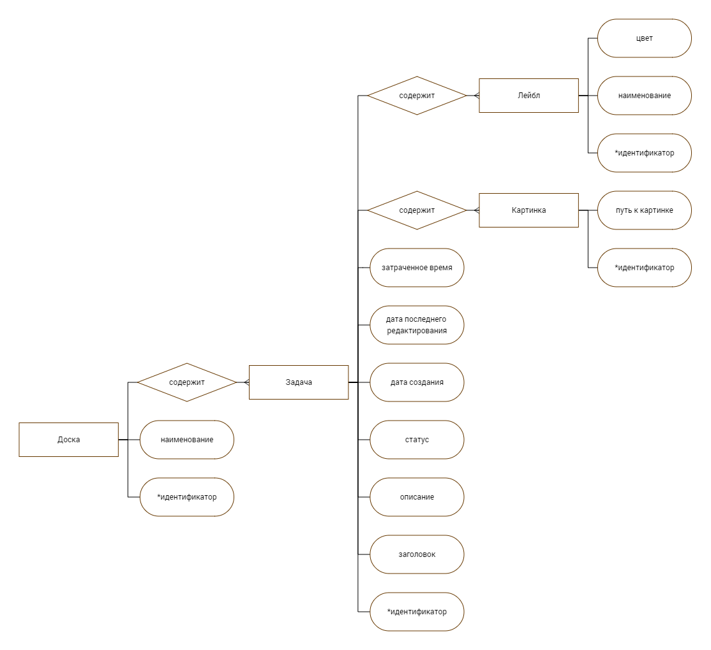
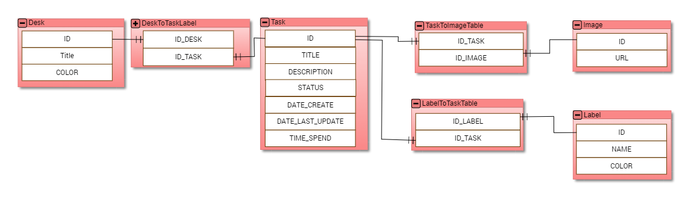
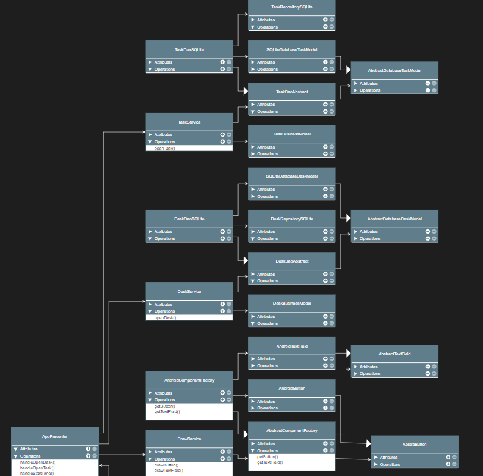
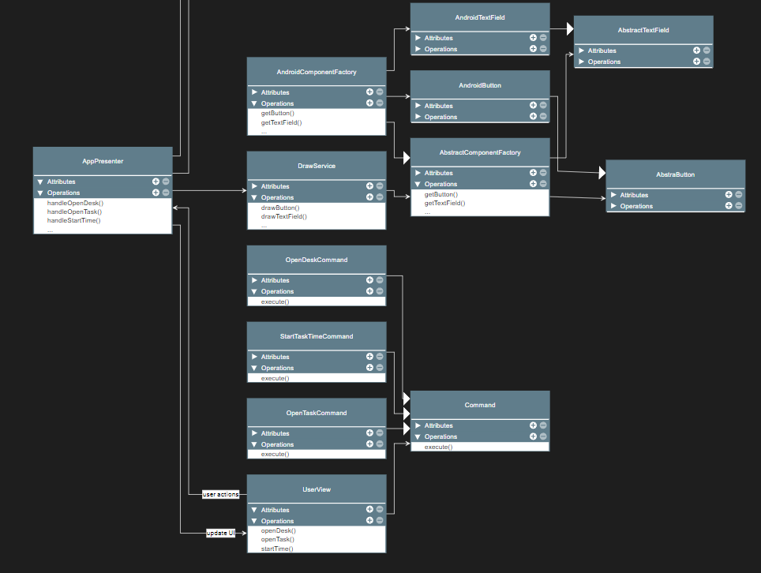

# Проект: Таск-менеджер задач

## Краткое описание

---

Приложение для телефона, которое позволяет вести todo листы, тем самым позволяя легко и просто заниматься планированием своего времени и дел

## Краткое описание предметной области

---

Предметная область - приложения для трекинга задач. Данное приложение должно давать возможность создавать задачи, добавлять в них описание и, при желании пользователя, подзадачи, переводить их в статус "выполнено", или "в работе", создавать отдельные доски, в которых будут храниться данные задачи.

## Анализ существующих решений

---

Критерии:
1. Возможность группировать задачи по дням недели
2. Возможность группировать задачи по общим категориям todo/in progress/done
3. Возможность отслеживать время, потораченное на задачу
4. Возможность рисовать диаграммы для проведения аналитики по разным задачам

В таблице ниже приведен анализ популярных существующих решений исходя из критериев выше

| Критерий | WEEK | TRELLO | TODOIST | 
|----------|----------|----------|----------|
| 1 | + | - | - |
| 2 | - | + | + |
| 3 | + | - | - |
| 4 | + | - | - |

## Use-case диаграмма

---

## Пользовательские сценарии (в текстовом виде)

---

### Сценарий 1

**Описание пользователя**:

Пользователь впервые заходит в приложение и хочет начать им пользоваться

**Цель пользователя**:

Создать доску и задачу в ней

**Объекты взаимодействия**:

- Экран со списком рабочих досок. Здесь он сможет создать рабочее пространство, в котором будут создаваться задачи и 
производиться работа с ними
- Рабочая доска. Здесь он сможет создать задачу, изменить ее статус переносом в один из столбцов (todo/in progress/done)
- Задача. В ней он может добавить описание, заголовок, картинки, повесить какой-либо лейбл, начать отслеживать время по
задаче.

### Сценарий 2

**Описание пользователя**:

Пользователь, пользующийся приложением хочет узнать статистическую информацию о его
задачах

**Цель пользователя**:

Перейти в раздел статистики и посомтреть кол-во выполненных задач по определенной доске

**Объекты взаимодействия**:

- Экран со статистикой. На данном экране пользователь может увидеть статистику задач по категориям
  (todo/in progress/done) и выполнить фильтрацию этих задач
- Инпут с выбором доски. Этот инпут будет отвечать за то, по какой доске будут просматривать задачи (или по
  всем доскам сразу)
- Инпут с фильтрацией по лейблам. Данный фильтр позволяет настроить отображение 
статистики в рамках конкретных лейблов задач (или по всем лейблам, если никакой не выбран).
- Поле отображения графиков. Здесь будет приведено визуальное отображение отфильтрованной статистики
  (гистограмма/круговая диаграмма/др.)

## ER-диаграмма

---

## UML диаграмма сущностей базы данных

---

## Диаграмма компонентов

---

